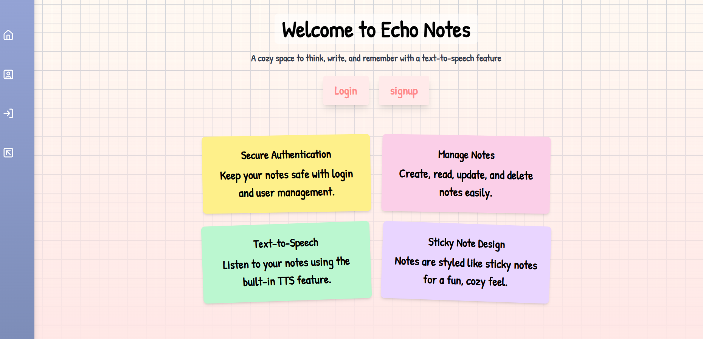
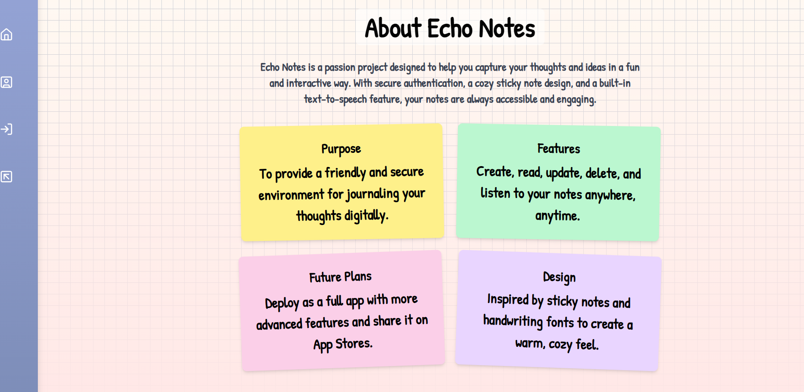
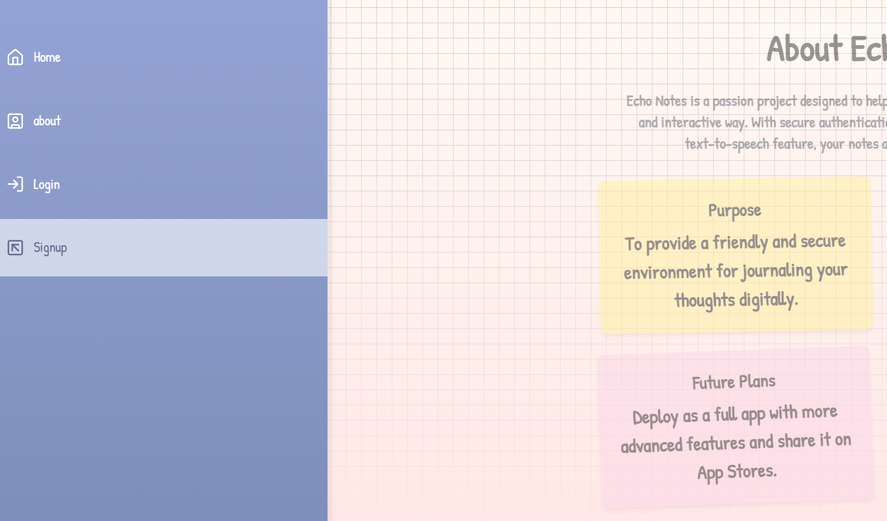
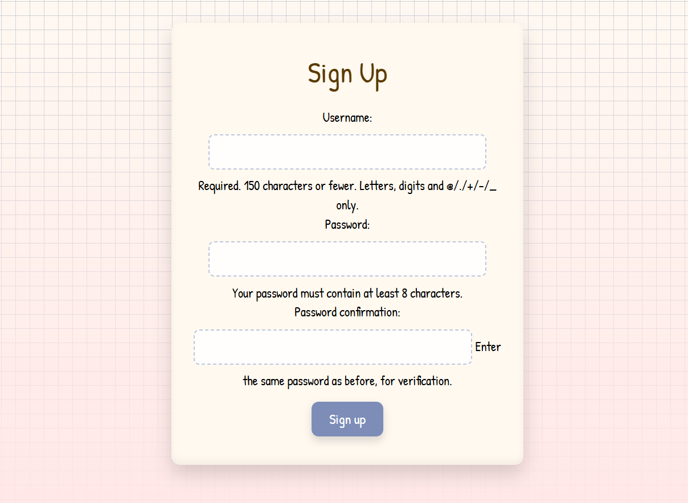
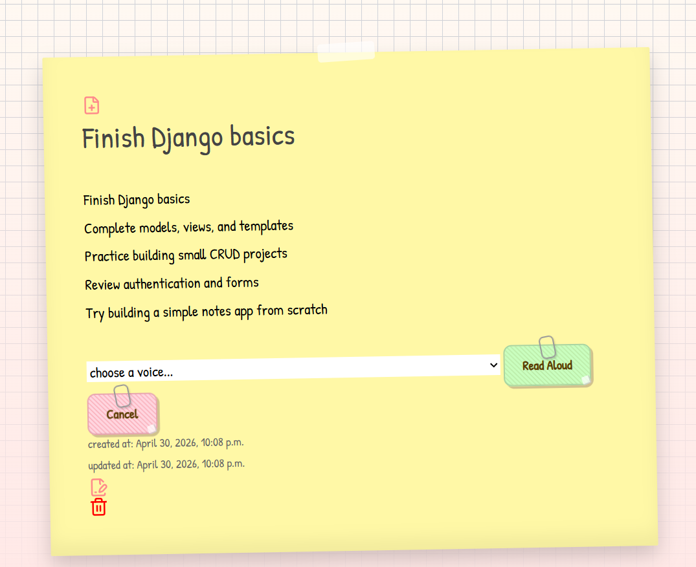

# Echo Notes

## Made By : Jameela Mohammed Saeed
 [linkedIn](https://www.linkedin.com/in/jameela-mohammed-/)

### Description

`A solo full-stack project built from scratch, handling both frontend and backend development.`

Echo Notes is a cozy, user-friendly AI-powered note-taking application with text-to-speech functionality. Users can write notes and have them read aloud using multiple voice options, making note-taking more interactive and accessible.

It combines a warm, sticky-notes-inspired design with practical functionality, offering a lightweight space to create, organize, and revisit ideas with audio playback support.

### features
* **Secure Authentication**
  * Users can sign up and log in securely
  * Notes are private and tied to individual accounts

* **Full Note Management (CRUD)**
  * Create, read, update, and delete notes with ease

* **Text-to-Speech (Web Speech API - SpeechSynthesis)**
  * Playback controls: play, pause, resume, and stop audio

* **Responsive Design**
  * Clean, paper-textured interface with a collapsible sidebar

* **Modern UI**
  * Minimalist design with smooth animations and intuitive layout

### Technologies
**Backend**
- Python
- Django

**Frontend**
- HTML
- CSS (Tailwind CSS)
- JavaScript
- Lucide Icons

### Demo
---
Home page

About page

SideBar Nav

Sign up

Add a note

Read/Update Note

Deleting a Note

---
### Future Features
- [ ] Text highlighting as it's being read
- [ ] Color picker for highlight customization
- [ ] Note categories/tags
- [ ] Search functionality
- [ ] Dark mode toggle
- [ ] Speed control for voice playback
- [ ] Speech-to-text functionality
- [ ] Expand Echo Notes into a full mobile application (iOS/Android) to improve accessibility and user experience

### credits/References
- [Sidebar Nav CSS](https://codepen.io/magnificode/pen/bdWYwy)
- [Text-to-speech JS](https://dev.to/devsmitra/convert-text-to-speech-in-javascript-using-speech-synthesis-api-223g)
- [text-to-speech](https://www.hongkiat.com/blog/text-to-speech/)
- [Web Speech API](https://developer.mozilla.org/en-US/docs/Web/API/Web_Speech_API)
- [SpeechSynthesis](https://developer.mozilla.org/en-US/docs/Web/API/SpeechSynthesisVoice)
